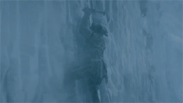

### becode-third-part

**Ici vous trouverez tous mes travaux réalisés pendant la Montagne chez Becode**

1. Learning-PHP
2. Data-Visualisation
3. cms-Composition (thème pas fini)
4. node.js
5. Validation badge(HTML)

## Qui suis je : 

Je m'apelle [Robby Delvaux](https://github.com/Delvaux1986) et voici mon [Linkedin](https://www.linkedin.com/in/robby-delvaux/).